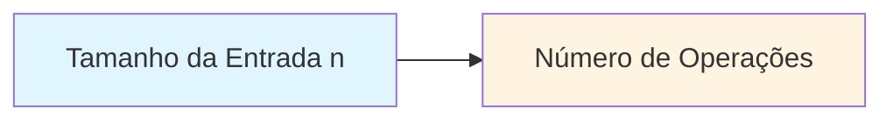
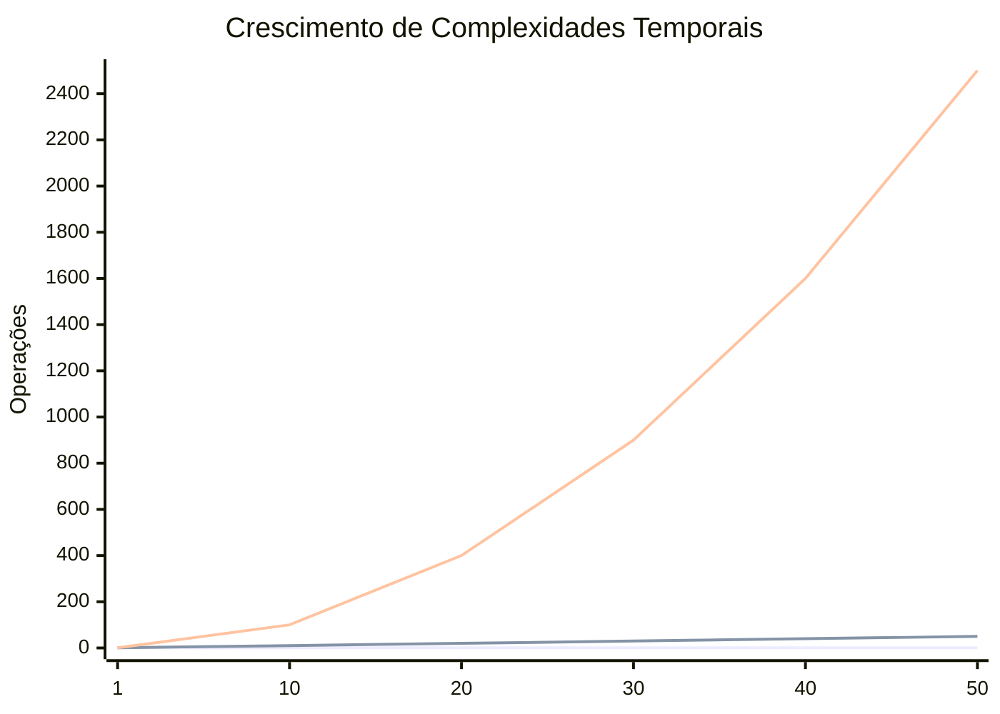
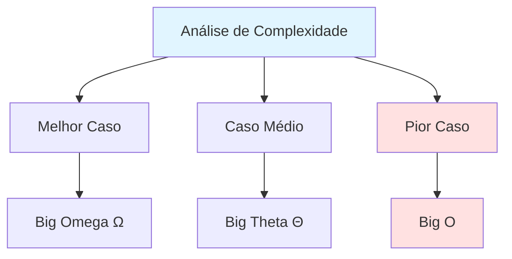

# Big O Notation: O GPS da Eficiência do Seu Código

> **"A diferença entre um código que funciona e um código que escala está na forma como ele cresce."**

## 🎯 O Que É Big O Notation?

Imagine que você precisa encontrar um livro específico. Se você tem apenas 10 livros em uma prateleira, qualquer método funciona rápido. Mas e se você tiver 10.000 livros? Ou 1 milhão?

A **Notação Big O** é como um sistema de classificação que nos diz: *"Quão rápido meu código fica mais lento à medida que os dados aumentam?"*

É uma forma matemática de descrever a **eficiência** de um algoritmo conforme o volume de dados cresce. Pense nela como a "etiqueta de eficiência energética" dos algoritmos - ela te diz se seu código é econômico ou desperdiçador.

### Por Que Isso É Fundamental?

- **Escalabilidade**: Um algoritmo que funciona com 100 itens pode travar com 100.000
- **Entrevistas Técnicas**: É um dos tópicos mais cobrados
- **Decisões Arquiteturais**: Escolher a estrutura de dados certa pode significar minutos vs horas de processamento
- **Consciência de Custos**: Em cloud computing, eficiência = economia de dinheiro

---

## ⏱️ Complexidade Temporal vs 💾 Complexidade Espacial

### Complexidade Temporal (Time Complexity)

**Analogia**: Quantos passos você precisa dar para atravessar um corredor?

Mede **quanto tempo** (em número de operações) um algoritmo leva para executar em função do tamanho da entrada.

### Complexidade Espacial (Space Complexity)

**Analogia**: Quanto espaço na sua mochila você precisa para carregar suas coisas?

Mede **quanta memória** adicional seu algoritmo precisa para executar em função do tamanho da entrada.

> 💡 **Dica**: Muitas vezes há um trade-off - você pode ganhar velocidade usando mais memória, ou economizar memória sacrificando velocidade.

---

## 📊 As Principais Ordens de Complexidade

Aqui está um gráfico visual mostrando como diferentes complexidades se comportam:





**Legenda**:
- Linha inferior (azul): O(1) - Constante
- Linha média (verde): O(n) - Linear
- Linha superior (vermelha): O(n²) - Quadrática

---

## 🚀 O(1) - Complexidade Constante

**Analogia**: Pegar um livro quando você sabe exatamente em qual prateleira e posição ele está.

**O que significa**: Não importa quantos dados você tem, sempre leva o **mesmo tempo** para executar.

### Exemplos de Código

**Python**
```python
def pegar_primeiro_elemento(lista):
    return lista[0]  # Sempre 1 operação

# Não importa se a lista tem 10 ou 10.000.000 elementos
```

**Java**
```java
public int pegarPrimeiroElemento(int[] array) {
    return array[0];  // Acesso direto = O(1)
}
```

**TypeScript**
```typescript
function pegarPrimeiroElemento(array: number[]): number {
    return array[0];  // Instantâneo, sempre!
}
```

> ⚡ **Característica**: Acesso direto a elementos (arrays, hash maps)

---

## 🪜 O(log n) - Complexidade Logarítmica

**Analogia**: Encontrar uma palavra no dicionário. Você abre no meio, vê se a palavra está antes ou depois, divide pela metade novamente, e repete.

**O que significa**: A cada passo, você **divide o problema pela metade**. Extremamente eficiente!

### Exemplos de Código

**Python**
```python
def busca_binaria(lista_ordenada, alvo):
    esquerda, direita = 0, len(lista_ordenada) - 1

    while esquerda <= direita:
        meio = (esquerda + direita) // 2

        if lista_ordenada[meio] == alvo:
            return meio
        elif lista_ordenada[meio] < alvo:
            esquerda = meio + 1
        else:
            direita = meio - 1

    return -1  # Não encontrado
```

**Java**
```java
public int buscaBinaria(int[] array, int alvo) {
    int esquerda = 0, direita = array.length - 1;

    while (esquerda <= direita) {
        int meio = esquerda + (direita - esquerda) / 2;

        if (array[meio] == alvo) return meio;
        if (array[meio] < alvo) esquerda = meio + 1;
        else direita = meio - 1;
    }

    return -1;
}
```

**TypeScript**
```typescript
function buscaBinaria(array: number[], alvo: number): number {
    let esquerda = 0;
    let direita = array.length - 1;

    while (esquerda <= direita) {
        const meio = Math.floor((esquerda + direita) / 2);

        if (array[meio] === alvo) return meio;
        if (array[meio] < alvo) esquerda = meio + 1;
        else direita = meio - 1;
    }

    return -1;
}
```

> 📚 **Curiosidade**: Em 1 milhão de elementos, busca linear = 1.000.000 operações. Busca binária = apenas 20 operações!

---

## 📏 O(n) - Complexidade Linear

**Analogia**: Procurar um livro percorrendo prateleira por prateleira, um por um.

**O que significa**: O tempo cresce **proporcionalmente** ao tamanho da entrada. Dobrou os dados? Dobrou o tempo.

### Exemplos de Código

**Python**
```python
def encontrar_maximo(lista):
    maximo = lista[0]

    for numero in lista:  # Percorre todos os elementos
        if numero > maximo:
            maximo = numero

    return maximo
```

**Java**
```java
public int encontrarMaximo(int[] array) {
    int maximo = array[0];

    for (int numero : array) {  // Um loop = O(n)
        if (numero > maximo) {
            maximo = numero;
        }
    }

    return maximo;
}
```

**TypeScript**
```typescript
function encontrarMaximo(array: number[]): number {
    let maximo = array[0];

    for (const numero of array) {
        if (numero > maximo) {
            maximo = numero;
        }
    }

    return maximo;
}
```

> ✅ **Identificação**: Um loop simples que percorre todos os elementos = O(n)

---

## 🔄 O(n log n) - Complexidade Linearítmica

**Analogia**: Organizar um baralho de cartas usando o método "dividir e conquistar" - você divide as cartas em grupos menores, ordena cada grupo, e depois junta tudo.

**O que significa**: Melhor do que O(n²) mas não tão rápido quanto O(n). É a complexidade dos **algoritmos de ordenação eficientes**.

### Exemplos de Código

**Python**
```python
def merge_sort(lista):
    if len(lista) <= 1:
        return lista

    # Divide
    meio = len(lista) // 2
    esquerda = merge_sort(lista[:meio])  # log n divisões
    direita = merge_sort(lista[meio:])

    # Conquista (merge = O(n))
    return merge(esquerda, direita)

def merge(esquerda, direita):
    resultado = []
    i = j = 0

    while i < len(esquerda) and j < len(direita):
        if esquerda[i] <= direita[j]:
            resultado.append(esquerda[i])
            i += 1
        else:
            resultado.append(direita[j])
            j += 1

    resultado.extend(esquerda[i:])
    resultado.extend(direita[j:])
    return resultado
```

**Java**
```java
public void mergeSort(int[] array, int esquerda, int direita) {
    if (esquerda < direita) {
        int meio = esquerda + (direita - esquerda) / 2;

        mergeSort(array, esquerda, meio);      // Divide
        mergeSort(array, meio + 1, direita);   // Divide
        merge(array, esquerda, meio, direita); // Conquista
    }
}
```

**TypeScript**
```typescript
function mergeSort(array: number[]): number[] {
    if (array.length <= 1) return array;

    const meio = Math.floor(array.length / 2);
    const esquerda = mergeSort(array.slice(0, meio));
    const direita = mergeSort(array.slice(meio));

    return merge(esquerda, direita);
}

function merge(esquerda: number[], direita: number[]): number[] {
    const resultado: number[] = [];
    let i = 0, j = 0;

    while (i < esquerda.length && j < direita.length) {
        if (esquerda[i] <= direita[j]) {
            resultado.push(esquerda[i++]);
        } else {
            resultado.push(direita[j++]);
        }
    }

    return resultado.concat(esquerda.slice(i)).concat(direita.slice(j));
}
```

> 🏆 **Algoritmos Famosos**: Merge Sort, Quick Sort (caso médio), Heap Sort

---

## 🐌 O(n²) - Complexidade Quadrática

**Analogia**: Comparar cada pessoa em uma sala com todas as outras pessoas (apertos de mão entre todos).

**O que significa**: Para cada elemento, você processa **todos os elementos novamente**. Dobrou a entrada? O tempo quadruplicou!

### Exemplos de Código

**Python**
```python
def bubble_sort(lista):
    n = len(lista)

    for i in range(n):           # Loop externo = n vezes
        for j in range(0, n-i-1): # Loop interno = n vezes
            if lista[j] > lista[j+1]:
                # Troca
                lista[j], lista[j+1] = lista[j+1], lista[j]

    return lista

# n × n = n²
```

**Java**
```java
public void bubbleSort(int[] array) {
    int n = array.length;

    for (int i = 0; i < n; i++) {           // n vezes
        for (int j = 0; j < n - i - 1; j++) { // n vezes
            if (array[j] > array[j + 1]) {
                int temp = array[j];
                array[j] = array[j + 1];
                array[j + 1] = temp;
            }
        }
    }
}
```

**TypeScript**
```typescript
function bubbleSort(array: number[]): number[] {
    const n = array.length;

    for (let i = 0; i < n; i++) {           // Loops aninhados
        for (let j = 0; j < n - i - 1; j++) { // = O(n²)
            if (array[j] > array[j + 1]) {
                [array[j], array[j + 1]] = [array[j + 1], array[j]];
            }
        }
    }

    return array;
}
```

> ⚠️ **Atenção**: Loops aninhados são o sinal clássico de O(n²). Evite quando possível!

---

## 🎯 Melhor Caso vs Pior Caso vs Caso Médio



### Melhor Caso (Best Case) - Ω (Omega)

O cenário **mais otimista** possível.

**Exemplo**: Buscar o número 5 em `[5, 2, 8, 1]` - está logo na primeira posição! O(1)

### Caso Médio (Average Case) - Θ (Theta)

O que acontece **na maioria das vezes**, considerando todas as possibilidades.

**Exemplo**: Em uma busca linear, em média você encontra o elemento no meio da lista.

### Pior Caso (Worst Case) - O (Big O)

O cenário **mais pessimista** possível.

**Exemplo**: Buscar o número 1 em `[5, 2, 8, 1]` - está na última posição! O(n)

### Por Que Focamos no Pior Caso?

> 🛡️ **Princípio da Engenharia**: Sempre planeje para o pior cenário!

- **Garantia**: Seu código nunca será mais lento que isso
- **Previsibilidade**: Você pode planejar recursos e infraestrutura
- **Confiabilidade**: Sistemas críticos precisam de garantias, não esperanças

**Analogia**: É como construir uma ponte - você calcula para o pior cenário (tráfego máximo + chuva + vento), não para o dia ensolarado sem carros.

---

## 🧮 Como Calcular Big O no Seu Código

### Regra 1: Ignore Constantes

```python
# Ambos são O(n), não O(2n) ou O(3n)
def exemplo1(lista):
    for item in lista:  # O(n)
        print(item)

def exemplo2(lista):
    for item in lista:  # O(n)
        print(item)
    for item in lista:  # + O(n)
        print(item * 2)
# Total: O(n) + O(n) = O(2n) → Simplifica para O(n)
```

**Por quê?** Big O descreve a **taxa de crescimento**, não o tempo exato. Quando n = 1.000.000, a diferença entre 2n e 3n é irrelevante.

### Regra 2: Descarte Termos Menores

```python
def exemplo(lista):
    print(lista[0])           # O(1)

    for item in lista:        # O(n)
        print(item)

    for i in lista:           # O(n²)
        for j in lista:
            print(i, j)

# Total: O(1) + O(n) + O(n²) → O(n²)
```

**Por quê?** Quando n é grande, n² domina completamente. Se n = 1000, então n² = 1.000.000, e o +1 e +1000 são desprezíveis.

### Regra 3: Diferentes Entradas = Diferentes Variáveis

```python
def processar(lista_a, lista_b):
    for item in lista_a:  # O(a)
        print(item)

    for item in lista_b:  # O(b)
        print(item)

# Total: O(a + b), NÃO O(n)
```

### Regra 4: Loops Aninhados = Multiplicação

```python
def produto_cartesiano(lista_a, lista_b):
    for a in lista_a:      # O(a)
        for b in lista_b:  # × O(b)
            print(a, b)

# Total: O(a × b)
```

---

## 🎓 Exercício Prático: Identifique o Big O

Tente identificar a complexidade antes de ver a resposta!

### Exercício 1
```python
def misterio1(n):
    soma = 0
    for i in range(n):
        soma += i
    return soma
```

<details>
<summary>👉 Clique para ver a resposta</summary>

**Resposta**: O(n) - Um loop simples de 0 até n.

</details>

### Exercício 2
```python
def misterio2(n):
    for i in range(n):
        for j in range(n):
            print(i, j)
```

<details>
<summary>👉 Clique para ver a resposta</summary>

**Resposta**: O(n²) - Dois loops aninhados, cada um executando n vezes.

</details>

### Exercício 3
```python
def misterio3(lista):
    if len(lista) == 0:
        return None
    return lista[len(lista) // 2]
```

<details>
<summary>👉 Clique para ver a resposta</summary>

**Resposta**: O(1) - Apenas cálculos e acesso direto a índice, sem loops.

</details>

---

## 📊 Tabela Resumo: Complexidades Comparadas

| Big O | Nome | Exemplo | 10 elementos | 100 elementos | 1000 elementos |
|-------|------|---------|--------------|---------------|----------------|
| O(1) | Constante | Acesso a array | 1 | 1 | 1 |
| O(log n) | Logarítmica | Busca binária | 3 | 7 | 10 |
| O(n) | Linear | Busca simples | 10 | 100 | 1000 |
| O(n log n) | Linearítmica | Merge sort | 30 | 700 | 10.000 |
| O(n²) | Quadrática | Bubble sort | 100 | 10.000 | 1.000.000 |
| O(2ⁿ) | Exponencial | Fibonacci recursivo | 1024 | 💥 | 💥💥💥 |

> 💥 = Praticamente impossível de executar em tempo razoável

---

## 🎯 Dicas Finais para Dominar Big O

### 1. Pratique Identificar Padrões
- 1 loop = geralmente O(n)
- 2 loops aninhados = geralmente O(n²)
- Dividindo o problema pela metade = geralmente O(log n)

### 2. Pense em Escala
Pergunte-se: "E se eu tivesse 1 bilhão de itens?"

### 3. Não Otimize Prematuramente
> "Premature optimization is the root of all evil" - Donald Knuth

Primeiro faça funcionar, depois faça rápido (se necessário).

### 4. Ferramentas Práticas
- **Python**: Use `timeit` para medir performance real
- **Java**: Use `System.nanoTime()`
- **JavaScript/TypeScript**: Use `console.time()` e `console.timeEnd()`

### 5. Lembre-se: Legibilidade Também Importa
Um código O(n) que ninguém entende é pior que um O(n log n) bem documentado.

---

## 🚀 Próximos Passos

Agora que você domina Big O, está pronto para:

1. **Estruturas de Dados**: Entender por que arrays, listas ligadas, hash maps e árvores têm diferentes complexidades
2. **Algoritmos de Ordenação**: Comparar Bubble Sort, Merge Sort, Quick Sort
3. **Algoritmos de Busca**: DFS, BFS, e suas aplicações
4. **Otimização**: Técnicas como memoização e programação dinâmica

---

## 💡 Pensamento Final

> **"Código que funciona é bom. Código que escala é excelente. Código que você entende por que escala é extraordinário."**

Big O não é sobre memorizar fórmulas - é sobre desenvolver **intuição** para escrever código eficiente. Continue praticando, e logo você estará identificando complexidades instantaneamente!

Bem-vindo ao mundo da análise de algoritmos. Você acabou de ganhar um superpoder! 🦸‍♂️

---

**📚 Recursos Adicionais Recomendados:**
- "Grokking Algorithms" - Aditya Bhargava (muito visual e didático)
- "Introduction to Algorithms" - CLRS (a bíblia, mais acadêmico)
- Leetcode.com - Para praticar com problemas reais
- Big-O Cheat Sheet (bigocheatsheet.com)

**Dúvidas?** Lembre-se: todo expert já foi iniciante. Continue praticando! 🌟
