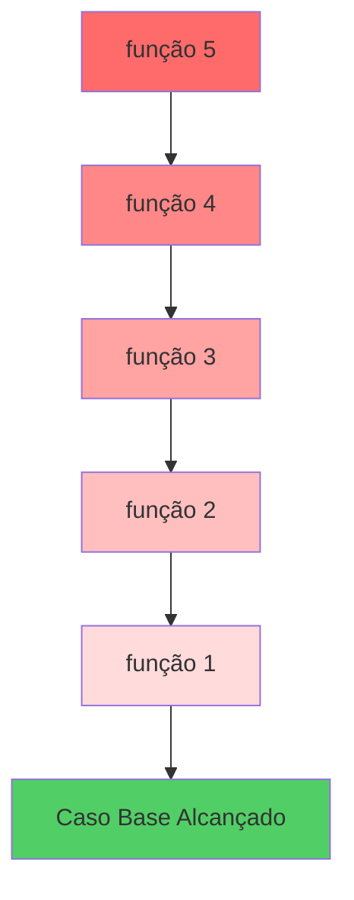
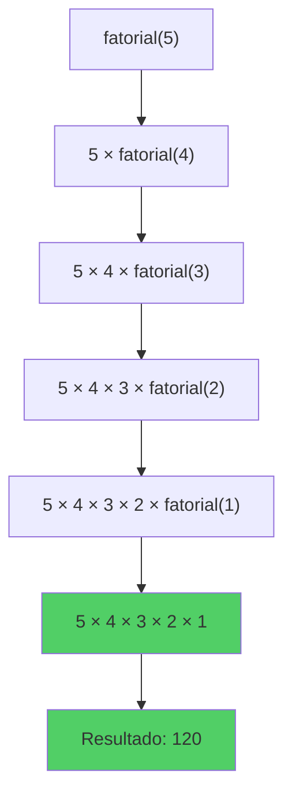
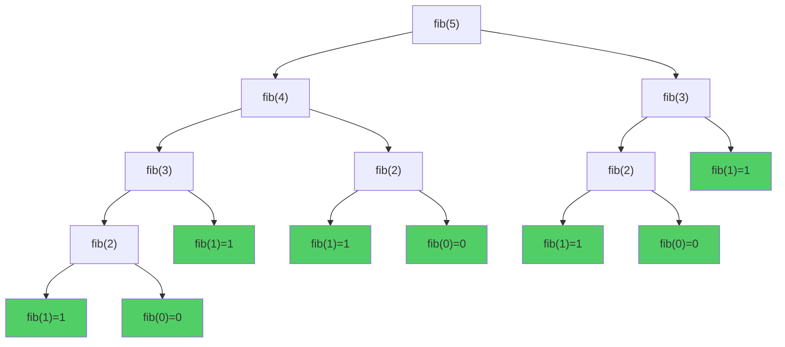

# Recursividade e Funções Recursivas

> **"A recursividade é como um espelho refletindo outro espelho: cada reflexo contém uma versão menor do problema até chegarmos ao reflexo final."**

## 🎯 O que é Recursividade?

**Recursividade** é uma técnica de programação onde uma função resolve um problema chamando a si mesma para resolver versões menores do mesmo problema. É como quebrar um grande desafio em pedaços menores e mais gerenciáveis até chegar a algo tão simples que você pode resolver diretamente.

### Por que usar Recursividade?

Imagine que você precisa procurar um documento em uma pilha de pastas, onde cada pasta pode conter outras pastas dentro. Você poderia:
1. Abrir a primeira pasta
2. Se encontrar o documento, pronto!
3. Se encontrar outra pasta, repetir o processo dentro dela

Essa é a essência da recursividade: **resolver problemas que têm uma estrutura naturalmente repetitiva**.

### Vantagens da Recursividade

- ✅ Código mais limpo e elegante para problemas complexos
- ✅ Solução natural para estruturas hierárquicas (árvores, grafos)
- ✅ Reduz problemas grandes em partes menores e mais simples

---

## 🔬 Anatomia de uma Função Recursiva

Toda função recursiva possui **dois componentes essenciais**:

### 1️⃣ Caso Base (Condição de Parada)

O **caso base** é a condição que interrompe a recursão. Sem ele, a função continuaria se chamando infinitamente!

> 💡 **Pense no caso base como o chão de um prédio**: você pode descer escadas, mas quando chega no térreo, para.

### 2️⃣ Caso Recursivo (Chamada Recursiva)

O **caso recursivo** é onde a função chama a si mesma com uma versão simplificada do problema original.

> 💡 **É como descer um degrau de cada vez**: cada chamada te aproxima do caso base.

### Estrutura Geral

```
função recursiva(parâmetros):
    se caso_base:
        retornar solução_simples
    senão:
        retornar função_recursiva(problema_menor)
```

---

## 📚 A Call Stack (Pilha de Chamadas)

### O que é a Call Stack?

A **Call Stack** é uma estrutura de memória que gerencia a execução de funções. Funciona como uma pilha de pratos: o último prato colocado é o primeiro a ser retirado (LIFO - Last In, First Out).

### Analogia: Bonecas Russas (Matryoshkas)

Imagine bonecas russas, onde cada boneca contém uma boneca menor dentro:

1. Você abre a primeira boneca (chamada inicial)
2. Dentro há outra boneca (segunda chamada)
3. Dentro dessa há outra menor (terceira chamada)
4. Até chegar na menor boneca que não abre mais (caso base)
5. Agora você fecha cada boneca, da menor para a maior (desempilhamento)

### Visualização da Call Stack



**Empilhamento** ⬇️ (chamadas sendo adicionadas)
→ **Caso Base Alcançado** 🎯
→ **Desempilhamento** ⬆️ (retornos sendo processados)

---

## ⚠️ Stack Overflow: O Perigo da Recursão Infinita

### O que é Stack Overflow?

**Stack Overflow** (estouro de pilha) ocorre quando a pilha de chamadas fica cheia demais, geralmente porque:

1. ❌ Você esqueceu de definir um caso base
2. ❌ O caso base nunca é alcançado
3. ❌ A recursão é muito profunda para a memória disponível

### Exemplo de Erro Comum

```python
# ⚠️ CUIDADO: Isso causará Stack Overflow!
def contagem_infinita(n):
    print(n)
    return contagem_infinita(n + 1)  # Sem caso base!

# contagem_infinita(1)  # Nunca execute isso!
```

### Como Evitar Stack Overflow

✅ **Sempre defina um caso base claro**
✅ **Garanta que a recursão se aproxima do caso base**
✅ **Teste com valores pequenos primeiro**
✅ **Considere iteração para problemas muito grandes**

---

## 📖 Exemplo 1: Cálculo de Fatorial

O fatorial de um número `n` (escrito como `n!`) é o produto de todos os números de 1 até `n`.

```
5! = 5 × 4 × 3 × 2 × 1 = 120
```

### Pensamento Recursivo

- **Caso Base**: `0! = 1` e `1! = 1`
- **Caso Recursivo**: `n! = n × (n-1)!`

### Visualização da Recursão



### Implementação em Python

```python
def fatorial(n):
    # Caso Base
    if n == 0 or n == 1:
        return 1

    # Caso Recursivo
    return n * fatorial(n - 1)

# Teste
print(fatorial(5))  # Saída: 120
```

### Implementação em Java

```java
public class Recursao {
    public static int fatorial(int n) {
        // Caso Base
        if (n == 0 || n == 1) {
            return 1;
        }

        // Caso Recursivo
        return n * fatorial(n - 1);
    }

    public static void main(String[] args) {
        System.out.println(fatorial(5));  // Saída: 120
    }
}
```

### Implementação em TypeScript

```typescript
function fatorial(n: number): number {
    // Caso Base
    if (n === 0 || n === 1) {
        return 1;
    }

    // Caso Recursivo
    return n * fatorial(n - 1);
}

// Teste
console.log(fatorial(5));  // Saída: 120
```

### Passo a Passo da Execução

| Chamada | Cálculo | Retorno |
|---------|---------|---------|
| `fatorial(5)` | `5 × fatorial(4)` | `5 × 24 = 120` |
| `fatorial(4)` | `4 × fatorial(3)` | `4 × 6 = 24` |
| `fatorial(3)` | `3 × fatorial(2)` | `3 × 2 = 6` |
| `fatorial(2)` | `2 × fatorial(1)` | `2 × 1 = 2` |
| `fatorial(1)` | Caso Base | `1` |

---

## 📖 Exemplo 2: Sequência de Fibonacci

A sequência de Fibonacci é uma série onde cada número é a soma dos dois anteriores:

```
0, 1, 1, 2, 3, 5, 8, 13, 21, 34...
```

### Definição Recursiva

- **Casos Base**: `fib(0) = 0` e `fib(1) = 1`
- **Caso Recursivo**: `fib(n) = fib(n-1) + fib(n-2)`

### Árvore de Recursão para fib(5)



> ⚠️ **Observação**: Repare que `fib(3)`, `fib(2)` e `fib(1)` são calculados múltiplas vezes! Isso torna a recursão simples ineficiente para Fibonacci.

### Implementação em Python

```python
def fibonacci(n):
    # Casos Base
    if n == 0:
        return 0
    if n == 1:
        return 1

    # Caso Recursivo
    return fibonacci(n - 1) + fibonacci(n - 2)

# Teste
print(fibonacci(6))  # Saída: 8
```

### Implementação em Java

```java
public class Fibonacci {
    public static int fibonacci(int n) {
        // Casos Base
        if (n == 0) {
            return 0;
        }
        if (n == 1) {
            return 1;
        }

        // Caso Recursivo
        return fibonacci(n - 1) + fibonacci(n - 2);
    }

    public static void main(String[] args) {
        System.out.println(fibonacci(6));  // Saída: 8
    }
}
```

### Implementação em TypeScript

```typescript
function fibonacci(n: number): number {
    // Casos Base
    if (n === 0) {
        return 0;
    }
    if (n === 1) {
        return 1;
    }

    // Caso Recursivo
    return fibonacci(n - 1) + fibonacci(n - 2);
}

// Teste
console.log(fibonacci(6));  // Saída: 8
```

---

## 🎓 Recursão vs Iteração

Nem sempre a recursão é a melhor escolha. Veja a comparação:

| Aspecto | Recursão | Iteração |
|---------|----------|----------|
| **Legibilidade** | ✅ Mais elegante para problemas recursivos | ⚠️ Pode ser verbosa |
| **Performance** | ⚠️ Overhead de chamadas de função | ✅ Geralmente mais rápida |
| **Memória** | ⚠️ Usa stack (risco de overflow) | ✅ Usa menos memória |
| **Casos de Uso** | Árvores, grafos, divisão e conquista | Loops simples, grandes volumes |

### Exemplo: Fatorial Iterativo

```python
def fatorial_iterativo(n):
    resultado = 1
    for i in range(2, n + 1):
        resultado *= i
    return resultado

print(fatorial_iterativo(5))  # Saída: 120
```

---

## 🚀 Dicas para Dominar Recursividade

1. **🎯 Sempre identifique o caso base primeiro** - É a fundação da sua recursão
2. **📉 Certifique-se de que o problema diminui** - Cada chamada recursiva deve te aproximar do caso base
3. **✍️ Desenhe a árvore de recursão** - Visualizar ajuda muito no entendimento
4. **🧪 Teste com valores pequenos** - Use `n=0`, `n=1`, `n=2` para validar sua lógica
5. **🔄 Considere alternativas** - Às vezes iteração é mais apropriada
6. **💾 Use memoization** - Guarde resultados já calculados para evitar recomputação

---

## 💡 Exercícios Práticos

Agora é sua vez de praticar! Tente implementar estas funções recursivas:

### Nível Iniciante
1. **Soma de N números naturais**: `soma(n) = n + soma(n-1)`
2. **Potência**: `pow(base, exp) = base * pow(base, exp-1)`
3. **Contagem regressiva**: Imprimir números de N até 0

### Nível Intermediário
4. **Soma de array**: Somar todos elementos de um array recursivamente
5. **Palíndromo**: Verificar se uma string é um palíndromo
6. **Inversão de string**: Inverter uma string usando recursão

### Nível Avançado
7. **Torre de Hanoi**: Resolver o clássico puzzle
8. **Busca binária**: Buscar elemento em array ordenado
9. **Gerador de permutações**: Gerar todas permutações de uma string

---

## 🎉 Conclusão

A recursividade é uma ferramenta poderosa no arsenal de todo programador. Embora possa parecer confusa no início, com prática você começará a reconhecer padrões e situações onde a recursão simplifica significativamente a solução.

> **Lembre-se**: Todo especialista já foi iniciante. A diferença está na persistência e na prática constante. Continue praticando e logo a recursividade se tornará uma segunda natureza para você!

**Próximos passos**: Explore estruturas de dados como árvores e grafos, onde a recursividade realmente brilha! 🌟

---

**📚 Recursos Adicionais**
- [Visualizador de Recursão](https://visualgo.net/en/recursion)
- [Python Tutor](http://pythontutor.com/) - Visualize a call stack em ação

**💬 Dúvidas?** A recursividade exige tempo para ser absorvida. Revise os exemplos, desenhe as árvores e pratique os exercícios. Você vai chegar lá! 🚀
