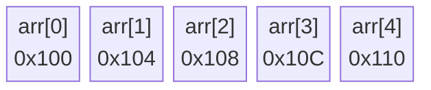
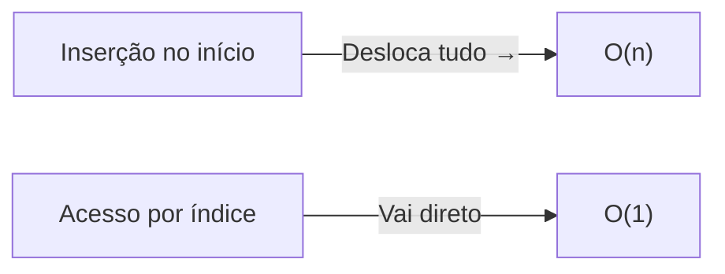
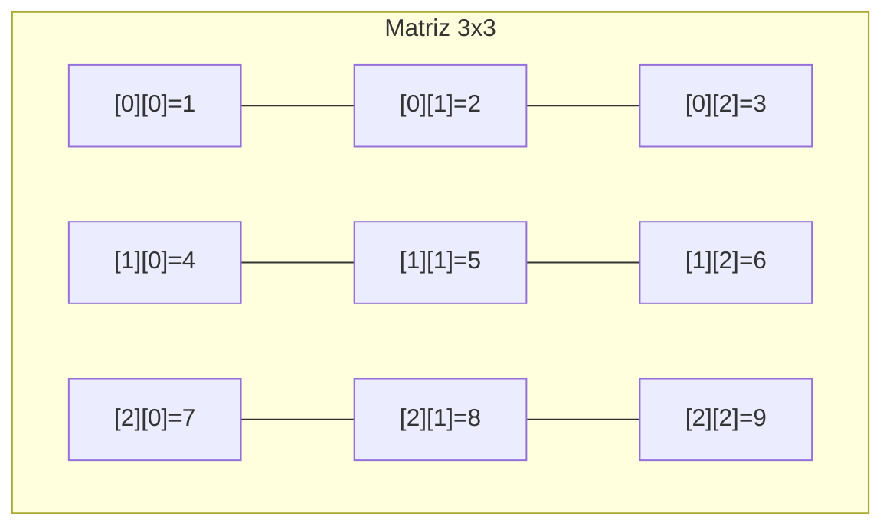
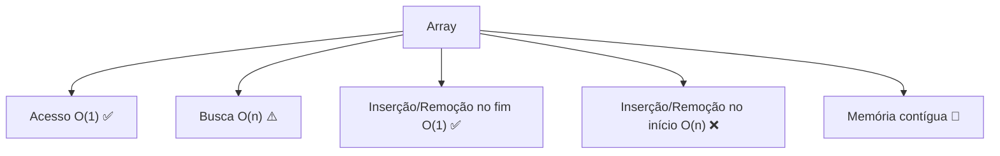

# Arrays — A Estrutura de Dados Mais Fundamental

> 💡 **Dica inicial:** Se você só pudesse aprender uma estrutura de dados, seria o Array. Ele está em tudo: desde um simples lista de nomes até o núcleo de algoritmos de ordenação complexos.

---

## 1. O que é um Array?

Imagine uma **fileira de armários numerados** em um corredor. Cada armário tem um número único (0, 1, 2, 3...) e pode guardar um item. Para pegar qualquer item, você só precisa saber o número do armário — e você chega lá **instantaneamente**, sem precisar verificar os outros.

Esse é o Array: uma **coleção de elementos armazenados em posições contíguas na memória**, onde cada elemento é acessado por um **índice numérico**.

```
Índice:  [  0  ] [  1  ] [  2  ] [  3  ] [  4  ]
Valor:   [ "A" ] [ "B" ] [ "C" ] [ "D" ] [ "E" ]
```

---

## 2. Como um Array funciona na memória?

Diferente de outras estruturas, os elementos de um array ficam **lado a lado na memória RAM**. Isso é o que torna o acesso tão rápido — o computador sabe exatamente onde cada elemento está com base no endereço inicial e no tamanho de cada item.



> 📌 **Por que isso importa?** A memória contígua é a razão pela qual arrays têm acesso O(1) — o índice é como um endereço de rua que você já conhece.

---

## 3. Operações e Complexidade (Big O)

| Operação              | Complexidade | Motivo                                              |
|-----------------------|--------------|-----------------------------------------------------|
| Acesso por índice     | **O(1)**     | Calcula diretamente o endereço de memória           |
| Busca por valor       | **O(n)**     | Pode precisar percorrer todos os elementos          |
| Inserção no fim       | **O(1)**     | Apenas coloca no próximo espaço disponível          |
| Inserção no início    | **O(n)**     | Desloca todos os outros elementos uma posição       |
| Remoção no fim        | **O(1)**     | Apenas remove o último elemento                     |
| Remoção no início     | **O(n)**     | Desloca todos os outros elementos uma posição       |



---

## 4. Arrays Estáticos vs Dinâmicos

### 🗂️ Array Estático
Tem tamanho **fixo**, definido na criação. É mais rápido e previsível, mas inflexível.

```java
// Java - array estático de tamanho 5
int[] numeros = new int[5];
```

### 📦 Array Dinâmico (como ArrayList/List)
Cresce automaticamente quando necessário. Por baixo dos panos, quando o array enche, ele cria um novo array maior e copia tudo — por isso a inserção amortizada ainda é O(1).

```python
# Python - lista dinâmica
numeros = []
numeros.append(1)  # O(1) amortizado
numeros.append(2)
numeros.append(3)
```

---

## 5. Exemplos de Código

### Acesso por índice — O(1)

**Python**
```python
frutas = ["maçã", "banana", "uva", "laranja"]
print(frutas[2])  # "uva" — acesso instantâneo
```

**Java**
```java
String[] frutas = {"maçã", "banana", "uva", "laranja"};
System.out.println(frutas[2]); // "uva"
```

**TypeScript**
```typescript
const frutas: string[] = ["maçã", "banana", "uva", "laranja"];
console.log(frutas[2]); // "uva"
```

---

### Busca por valor — O(n)

**Python**
```python
def buscar(arr, alvo):
    for i in range(len(arr)):
        if arr[i] == alvo:
            return i
    return -1

print(buscar([10, 20, 30, 40], 30))  # 2
```

**Java**
```java
int buscar(int[] arr, int alvo) {
    for (int i = 0; i < arr.length; i++) {
        if (arr[i] == alvo) return i;
    }
    return -1;
}
```

**TypeScript**
```typescript
function buscar(arr: number[], alvo: number): number {
    for (let i = 0; i < arr.length; i++) {
        if (arr[i] === alvo) return i;
    }
    return -1;
}
```

---

### Inserção no início — O(n)

**Python**
```python
arr = [2, 3, 4, 5]
arr.insert(0, 1)  # Desloca tudo para a direita
print(arr)  # [1, 2, 3, 4, 5]
```

**Java**
```java
// Em Java puro, é necessário deslocar manualmente
int[] arr = {2, 3, 4, 5, 0}; // espaço extra no fim
for (int i = arr.length - 1; i > 0; i--) {
    arr[i] = arr[i - 1];
}
arr[0] = 1;
```

**TypeScript**
```typescript
const arr: number[] = [2, 3, 4, 5];
arr.unshift(1); // Insere no início, desloca o resto
console.log(arr); // [1, 2, 3, 4, 5]
```

---

## 6. Quando usar Arrays?

✅ **Use Arrays quando:**
- Você sabe (ou estima) o tamanho da coleção.
- Precisa de acesso aleatório rápido por índice.
- Os elementos são do mesmo tipo.
- Desempenho é prioridade (cache-friendly por conta da memória contígua).

❌ **Evite Arrays quando:**
- Há muitas inserções/remoções no meio ou início da coleção.
- O tamanho varia muito e de forma imprevisível.
- Você precisa de busca frequente sem índice (considere Dicionários/HashMaps).

---

## 7. Arrays Multidimensionais

Arrays podem ter mais de uma dimensão — pense em uma **planilha** ou um **tabuleiro de xadrez**.

```python
# Matriz 3x3 (array bidimensional)
matriz = [
    [1, 2, 3],
    [4, 5, 6],
    [7, 8, 9]
]
print(matriz[1][2])  # 6 (linha 1, coluna 2)
```



---

## 8. Resumo Visual



---

> 🚀 **Próximos passos:** Agora que você domina Arrays, o próximo passo natural é aprender **Linked Lists** — uma estrutura que resolve exatamente o maior problema dos arrays: inserções e remoções no meio são O(n). Spoiler: cada solução tem seu trade-off!
