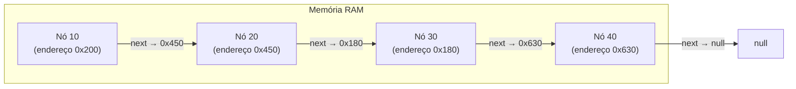
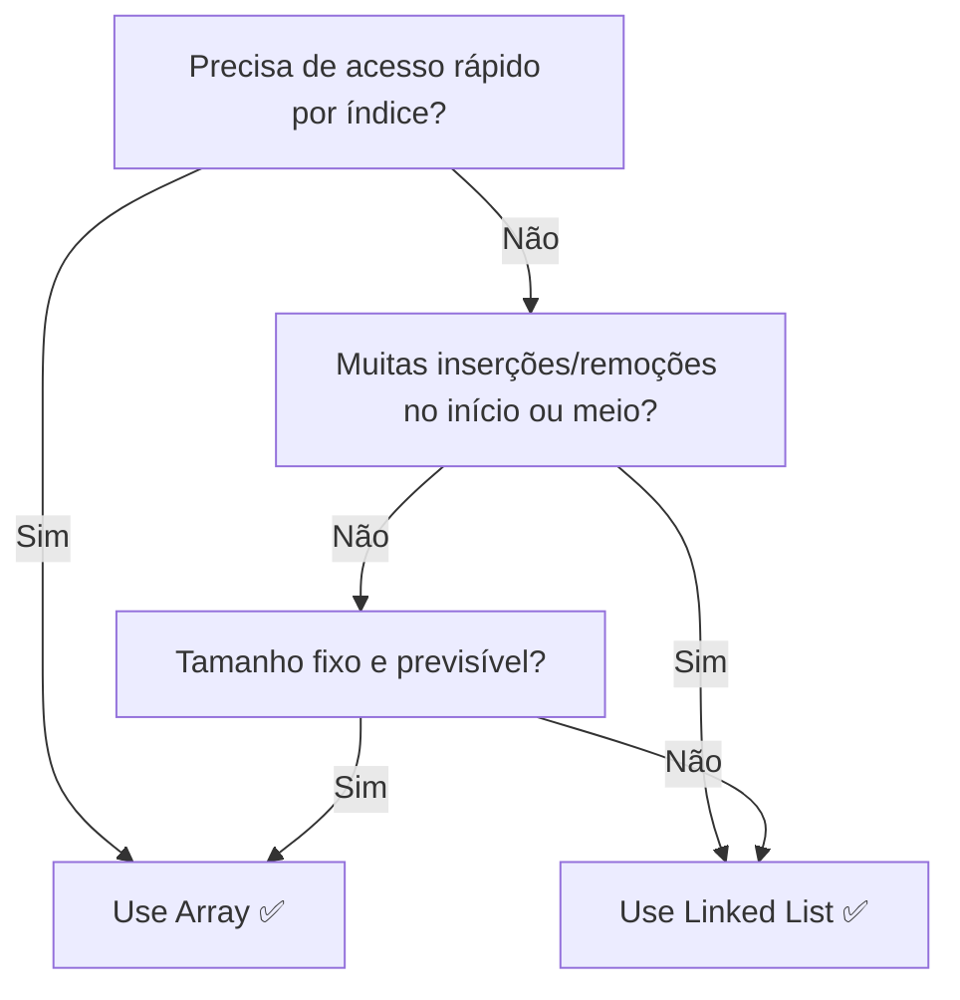
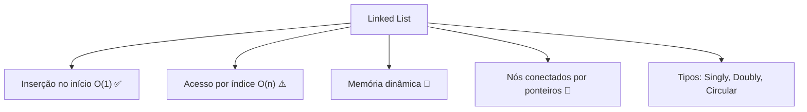

# Linked Lists — A Corrente de Nós

> 💡 **Dica inicial:** Se o Array é uma fileira de armários numerados, a Linked List é uma caça ao tesouro: cada pista (nó) te leva à próxima, e você só encontra o final seguindo toda a corrente.

---

## 1. O que é uma Linked List?

Uma **Lista Encadeada (Linked List)** é uma estrutura de dados composta por **nós (nodes)**. Cada nó possui dois componentes:

1. **Dado (data):** o valor armazenado.
2. **Ponteiro (next):** a referência para o próximo nó da lista.

Diferente dos Arrays, os elementos **não** precisam estar em posições contíguas na memória. Eles podem estar espalhados, e o que os conecta é o ponteiro.

```
[10 | •] ──► [20 | •] ──► [30 | •] ──► [40 | null]
  head                                    tail
```

---

## 2. Tipos de Linked List

### 🔗 Singly Linked List (Simplesmente Encadeada)
Cada nó aponta apenas para o **próximo**. É a mais simples.

```
[A | →] → [B | →] → [C | →] → [null]
```

### 🔄 Doubly Linked List (Duplamente Encadeada)
Cada nó aponta para o **próximo** e para o **anterior**. Permite navegar nos dois sentidos.

```
[null ← | A | →] ⟷ [← | B | →] ⟷ [← | C | → null]
```

### 🔁 Circular Linked List
O último nó aponta de volta para o **primeiro**, formando um ciclo. Útil para filas circulares.

```
[A | →] → [B | →] → [C | →] ─────┐
  ▲                               │
  └───────────────────────────────┘
```

---

## 3. Operações e Complexidade (Big O)

| Operação                  | Complexidade | Motivo                                                      |
|---------------------------|--------------|-------------------------------------------------------------|
| Acesso por índice         | **O(n)**     | Precisa percorrer do início até o nó desejado               |
| Busca por valor           | **O(n)**     | Percorre nó a nó                                            |
| Inserção no início (head) | **O(1)**     | Apenas redireciona o ponteiro head                          |
| Inserção no fim (tail)    | **O(1)***** | Com ponteiro tail; sem ele é O(n)                           |
| Inserção no meio          | **O(n)**     | Precisa encontrar a posição primeiro                        |
| Remoção no início         | **O(1)**     | Apenas move o head para o próximo nó                        |
| Remoção no fim            | **O(n)**     | Precisa chegar até o penúltimo nó para atualizar o ponteiro |

> ⚠️ **Atenção:** A grande vantagem da Linked List sobre o Array é a **inserção/remoção no início em O(1)**. A grande desvantagem é o **acesso aleatório em O(n)**.

---

## 4. Como funciona na Memória?

Ao contrário do Array, os nós de uma Linked List ficam **espalhados na memória**. Isso tem prós e contras:



**Vantagem:** Não precisa de memória contígua — pode crescer livremente.
**Desvantagem:** Usa mais memória por nó (armazena dado + ponteiro) e é menos eficiente em cache.

---

## 5. Exemplos de Código

### Estrutura de um Nó e da Lista

**Python**
```python
class Node:
    def __init__(self, data):
        self.data = data
        self.next = None

class LinkedList:
    def __init__(self):
        self.head = None

    def inserir_no_inicio(self, data):
        novo_no = Node(data)
        novo_no.next = self.head
        self.head = novo_no

    def imprimir(self):
        atual = self.head
        while atual:
            print(atual.data, end=" → ")
            atual = atual.next
        print("null")

lista = LinkedList()
lista.inserir_no_inicio(30)
lista.inserir_no_inicio(20)
lista.inserir_no_inicio(10)
lista.imprimir()  # 10 → 20 → 30 → null
```

**Java**
```java
class Node {
    int data;
    Node next;
    Node(int data) { this.data = data; this.next = null; }
}

class LinkedList {
    Node head;

    void inserirNoInicio(int data) {
        Node novoNo = new Node(data);
        novoNo.next = head;
        head = novoNo;
    }

    void imprimir() {
        Node atual = head;
        while (atual != null) {
            System.out.print(atual.data + " → ");
            atual = atual.next;
        }
        System.out.println("null");
    }
}
```

**TypeScript**
```typescript
class Node<T> {
    data: T;
    next: Node<T> | null = null;
    constructor(data: T) { this.data = data; }
}

class LinkedList<T> {
    head: Node<T> | null = null;

    inserirNoInicio(data: T): void {
        const novoNo = new Node(data);
        novoNo.next = this.head;
        this.head = novoNo;
    }

    imprimir(): void {
        let atual = this.head;
        const partes: string[] = [];
        while (atual) {
            partes.push(String(atual.data));
            atual = atual.next;
        }
        console.log(partes.join(" → ") + " → null");
    }
}
```

---

### Remoção de um Nó — O(n)

**Python**
```python
def remover(self, valor):
    if self.head and self.head.data == valor:
        self.head = self.head.next  # O(1) se for o head
        return

    atual = self.head
    while atual and atual.next:
        if atual.next.data == valor:
            atual.next = atual.next.next  # "pula" o nó a ser removido
            return
        atual = atual.next
```

---

## 6. Array vs Linked List — Quando usar cada um?



| Critério                       | Array     | Linked List |
|-------------------------------|-----------|-------------|
| Acesso por índice              | O(1) ✅   | O(n) ❌    |
| Inserção/Remoção no início     | O(n) ❌   | O(1) ✅    |
| Memória                        | Compacta  | Extra (ponteiros) |
| Flexibilidade de tamanho       | Limitada  | Alta        |
| Cache-friendly                 | Sim ✅    | Não ❌     |

---

## 7. Casos de Uso no Mundo Real

- **Histórico do navegador:** cada página visitada é um nó que aponta para a anterior (doubly linked list permite voltar/avançar).
- **Fila de músicas:** adicionar ao fim e remover do início de forma eficiente.
- **Implementação de Pilhas e Filas:** a Linked List é a base interna dessas estruturas.
- **Gerenciamento de memória do SO:** listas livres (free lists) de blocos de memória.

---

## 8. Resumo Visual



---

> 🚀 **Próximos passos:** Com Arrays e Linked Lists no seu arsenal, você está pronto para entender estruturas que se **constroem em cima delas**: **Filas (Queues)** e **Pilhas (Stacks)**. Ambas são incrivelmente poderosas e usadas no dia a dia do desenvolvimento de software!
