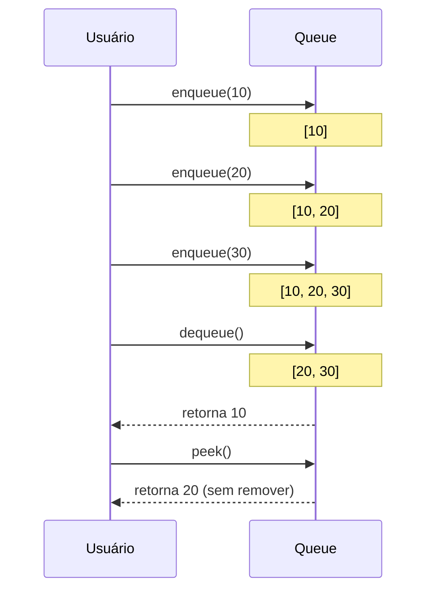
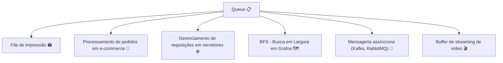
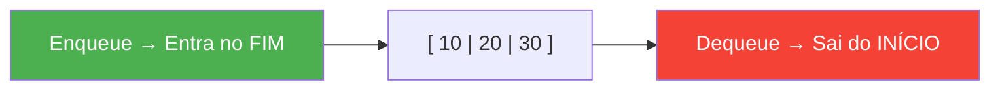

# Queues (Filas) — O Princípio da Justiça: Primeiro a Chegar, Primeiro a Sair

> 💡 **Dica inicial:** Pense na fila do banco, do supermercado ou de um parque de diversões. Quem chega primeiro, é atendido primeiro. Esse é exatamente o princípio de uma Queue!

---

## 1. O que é uma Queue?

Uma **Queue (Fila)** é uma estrutura de dados que segue o princípio **FIFO — First In, First Out** (Primeiro a Entrar, Primeiro a Sair).

Elementos são sempre:
- **Adicionados no fim** (enqueue / push_back)
- **Removidos do início** (dequeue / pop_front)

```
Entrada (enqueue) ───►  [ 10 | 20 | 30 | 40 ]  ───► Saída (dequeue)
                         ↑                      ↑
                        tail                  head
```

> Imagine uma fila de impressão: o primeiro documento enviado é o primeiro a ser impresso. Os outros esperam na ordem em que chegaram.

---

## 2. Operações Fundamentais

| Operação       | Descrição                                | Complexidade |
|----------------|------------------------------------------|--------------|
| **Enqueue**    | Adiciona um elemento ao fim da fila      | **O(1)**     |
| **Dequeue**    | Remove o elemento do início da fila      | **O(1)**     |
| **Peek/Front** | Consulta o elemento do início sem remove | **O(1)**     |
| **IsEmpty**    | Verifica se a fila está vazia            | **O(1)**     |
| **Size**       | Retorna o número de elementos            | **O(1)**     |

> 🎯 **A grande vantagem da Queue:** todas as operações principais são O(1)!

---

## 3. Visualizando o Fluxo FIFO



---

## 4. Implementação

### Usando Array/Lista (simples, mas pode ser O(n) no dequeue)

**Python**
```python
from collections import deque

fila = deque()

# Enqueue
fila.append(10)
fila.append(20)
fila.append(30)

print(fila)         # deque([10, 20, 30])

# Dequeue
primeiro = fila.popleft()
print(primeiro)     # 10
print(fila)         # deque([20, 30])

# Peek
print(fila[0])      # 20
```

> 💡 Em Python, use `collections.deque` ao invés de uma `list` simples para operações O(1) em ambos os lados.

**Java**
```java
import java.util.LinkedList;
import java.util.Queue;

Queue<Integer> fila = new LinkedList<>();

// Enqueue
fila.offer(10);
fila.offer(20);
fila.offer(30);

// Peek
System.out.println(fila.peek()); // 10

// Dequeue
System.out.println(fila.poll()); // 10
System.out.println(fila);        // [20, 30]
```

**TypeScript**
```typescript
class Queue<T> {
    private items: T[] = [];

    enqueue(item: T): void {
        this.items.push(item); // adiciona no fim
    }

    dequeue(): T | undefined {
        return this.items.shift(); // remove do início — O(n) com array simples
    }

    peek(): T | undefined {
        return this.items[0];
    }

    isEmpty(): boolean {
        return this.items.length === 0;
    }

    size(): number {
        return this.items.length;
    }
}

const fila = new Queue<number>();
fila.enqueue(10);
fila.enqueue(20);
fila.enqueue(30);
console.log(fila.dequeue()); // 10
console.log(fila.peek());    // 20
```

---

## 5. Queue com Linked List (implementação eficiente O(1))

Usando Linked List com ponteiros para head e tail, conseguimos O(1) em enqueue e dequeue:

**Python**
```python
class Node:
    def __init__(self, data):
        self.data = data
        self.next = None

class Queue:
    def __init__(self):
        self.head = None  # frente da fila
        self.tail = None  # fim da fila
        self.length = 0

    def enqueue(self, data):
        novo = Node(data)
        if self.tail:
            self.tail.next = novo
        self.tail = novo
        if not self.head:
            self.head = novo
        self.length += 1

    def dequeue(self):
        if not self.head:
            return None
        valor = self.head.data
        self.head = self.head.next
        if not self.head:
            self.tail = None
        self.length -= 1
        return valor

    def peek(self):
        return self.head.data if self.head else None
```

---

## 6. Variações de Queues

### 🔄 Circular Queue (Fila Circular)
Quando o fim da fila "conecta" ao início, evitando desperdício de espaço em arrays fixos.

```
        ┌─────────────────────┐
        ▼                     │
[ _ | 20 | 30 | 40 | _ | _ ] │
      ↑                ↑      │
     head             tail────┘
```

### ⚡ Priority Queue (Fila de Prioridade)
Cada elemento tem uma prioridade. O elemento de maior prioridade é servido primeiro, independente da ordem de chegada. É implementada com um **Heap** internamente.

```
Urgência Alta:  [🚑 Ambulância] → atendida PRIMEIRO
Urgência Média: [🚗 Carro]
Urgência Baixa: [🚲 Bicicleta] → atendida por ÚLTIMO
```

### 🔁 Deque (Double-Ended Queue)
Permite inserção e remoção em **ambas as extremidades**.

---

## 7. Casos de Uso no Mundo Real



---

## 8. Queue vs Stack — A Diferença Fundamental

| Característica | Queue (Fila)       | Stack (Pilha)      |
|----------------|--------------------|--------------------|
| Princípio      | FIFO               | LIFO               |
| Analogia       | Fila do banco      | Pilha de pratos    |
| Adição         | Fim (enqueue)      | Topo (push)        |
| Remoção        | Início (dequeue)   | Topo (pop)         |
| Uso típico     | BFS, mensageria    | DFS, undo/redo     |

---

## 9. Resumo Visual



---

> 🚀 **Próximos passos:** Você acabou de aprender a Fila. Agora vamos conhecer a **Pilha (Stack)** — a estrutura "gêmea invertida" da Queue, que ao invés de FIFO usa o princípio LIFO. Ela está por trás de coisas que você usa todo dia: o botão de "desfazer" (Ctrl+Z) e a própria execução de funções no seu programa!
