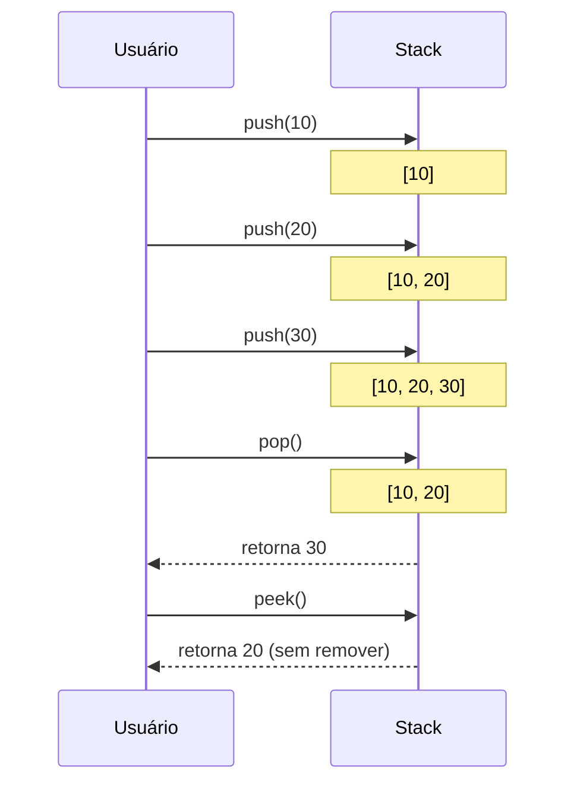
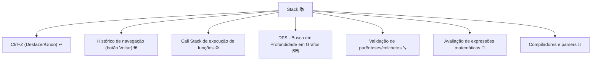
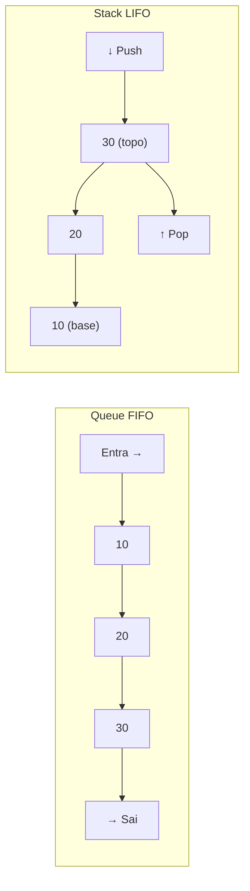
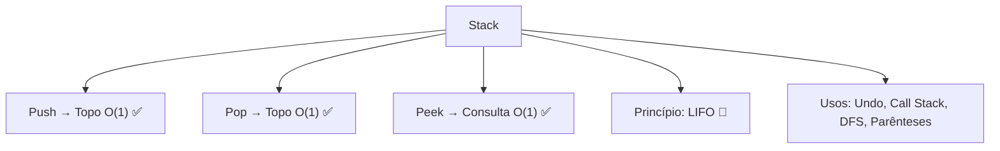

# Stacks (Pilhas) — O Último a Entrar é o Primeiro a Sair

> 💡 **Dica inicial:** Pense em uma pilha de pratos. Você sempre coloca o novo prato em cima, e sempre pega o que está no topo. Nunca pega o de baixo sem antes pegar todos os de cima. Isso é uma Stack!

---

## 1. O que é uma Stack?

Uma **Stack (Pilha)** é uma estrutura de dados que segue o princípio **LIFO — Last In, First Out** (Último a Entrar, Primeiro a Sair).

Elementos são sempre:
- **Adicionados no topo** (push)
- **Removidos do topo** (pop)

```
        ┌──────┐
        │  40  │  ← topo (último adicionado, primeiro a sair)
        ├──────┤
        │  30  │
        ├──────┤
        │  20  │
        ├──────┤
        │  10  │  ← base (primeiro adicionado, último a sair)
        └──────┘
```

---

## 2. Operações Fundamentais

| Operação    | Descrição                                      | Complexidade |
|-------------|------------------------------------------------|--------------|
| **Push**    | Adiciona um elemento no topo da pilha          | **O(1)**     |
| **Pop**     | Remove e retorna o elemento do topo            | **O(1)**     |
| **Peek/Top**| Consulta o topo sem remover                    | **O(1)**     |
| **IsEmpty** | Verifica se a pilha está vazia                 | **O(1)**     |
| **Size**    | Retorna o número de elementos                  | **O(1)**     |

> 🎯 Assim como a Queue, todas as operações principais da Stack são **O(1)**!

---

## 3. Visualizando o Fluxo LIFO



---

## 4. Implementação

### Usando Array/Lista

**Python**
```python
# Python: lista já funciona perfeitamente como Stack
pilha = []

# Push
pilha.append(10)
pilha.append(20)
pilha.append(30)

print(pilha)        # [10, 20, 30]

# Peek
print(pilha[-1])    # 30 (topo)

# Pop
topo = pilha.pop()
print(topo)         # 30
print(pilha)        # [10, 20]
```

**Java**
```java
import java.util.Stack;

Stack<Integer> pilha = new Stack<>();

// Push
pilha.push(10);
pilha.push(20);
pilha.push(30);

// Peek
System.out.println(pilha.peek()); // 30

// Pop
System.out.println(pilha.pop());  // 30
System.out.println(pilha);        // [10, 20]
```

**TypeScript**
```typescript
class Stack<T> {
    private items: T[] = [];

    push(item: T): void {
        this.items.push(item);
    }

    pop(): T | undefined {
        return this.items.pop();
    }

    peek(): T | undefined {
        return this.items[this.items.length - 1];
    }

    isEmpty(): boolean {
        return this.items.length === 0;
    }

    size(): number {
        return this.items.length;
    }
}

const pilha = new Stack<number>();
pilha.push(10);
pilha.push(20);
pilha.push(30);
console.log(pilha.pop());   // 30
console.log(pilha.peek());  // 20
```

---

## 5. A Call Stack — A Stack que Roda seus Programas

Um dos exemplos mais importantes de Stack na prática é a **Call Stack** — a pilha de chamadas de função que o motor de execução usa para rastrear onde o programa está.

Quando você chama uma função, ela entra na pilha. Quando ela termina, sai.

**Python**
```python
def c():
    print("Dentro de c()")

def b():
    c()  # c() entra na pilha
    print("Voltou para b()")

def a():
    b()  # b() entra na pilha
    print("Voltou para a()")

a()
```

```
Chamada de a()    → push(a)
  Chamada de b()  → push(b)
    Chamada de c() → push(c)
    c() termina    → pop(c)
  b() termina      → pop(b)
a() termina        → pop(a)

Stack durante c():
┌─────┐
│ c() │ ← topo
├─────┤
│ b() │
├─────┤
│ a() │ ← base
└─────┘
```

> 💥 **Stack Overflow!** Quando há recursão infinita, a call stack enche indefinidamente até o programa travar. Daí vem o nome do site famoso!

---

## 6. Casos de Uso no Mundo Real



---

## 7. Exemplo Prático — Validador de Parênteses

Um problema clássico resolvido com Stack: verificar se uma sequência de parênteses, colchetes e chaves está balanceada.

**Python**
```python
def validar_parenteses(s: str) -> bool:
    pilha = []
    pares = {')': '(', ']': '[', '}': '{'}

    for char in s:
        if char in '([{':
            pilha.append(char)        # abre: empilha
        elif char in ')]}':
            if not pilha or pilha[-1] != pares[char]:
                return False
            pilha.pop()               # fecha: desempilha o par

    return len(pilha) == 0            # válido se pilha vazia

print(validar_parenteses("({[]})"))   # True
print(validar_parenteses("({[})"))    # False
print(validar_parenteses("[](){}"))   # True
```

**TypeScript**
```typescript
function validarParenteses(s: string): boolean {
    const pilha: string[] = [];
    const pares: Record<string, string> = { ')': '(', ']': '[', '}': '{' };

    for (const char of s) {
        if ('([{'.includes(char)) {
            pilha.push(char);
        } else if (')]}'.includes(char)) {
            if (pilha.length === 0 || pilha[pilha.length - 1] !== pares[char]) {
                return false;
            }
            pilha.pop();
        }
    }
    return pilha.length === 0;
}
```

---

## 8. Stack vs Queue — Resumo Comparativo



| Conceito    | Stack (Pilha) | Queue (Fila) |
|-------------|---------------|--------------|
| Princípio   | LIFO          | FIFO         |
| Analogia    | Pilha de pratos | Fila do banco |
| Entrada     | Topo (push)   | Fim (enqueue)|
| Saída       | Topo (pop)    | Início (dequeue)|

---

## 9. Resumo Visual



---

> 🚀 **Próximos passos:** Você agora conhece as estruturas lineares fundamentais. É hora de dar um salto e entrar nas estruturas **hierárquicas**: as **Árvores Binárias (Binary Trees)**. Elas mudam completamente a forma como organizamos e buscamos dados, abrindo a porta para algoritmos de busca muito mais eficientes!
