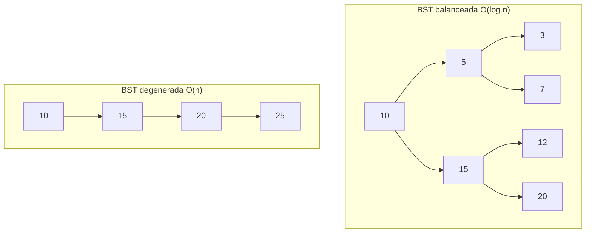
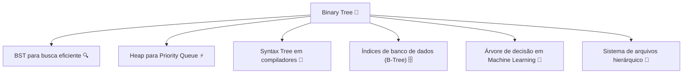
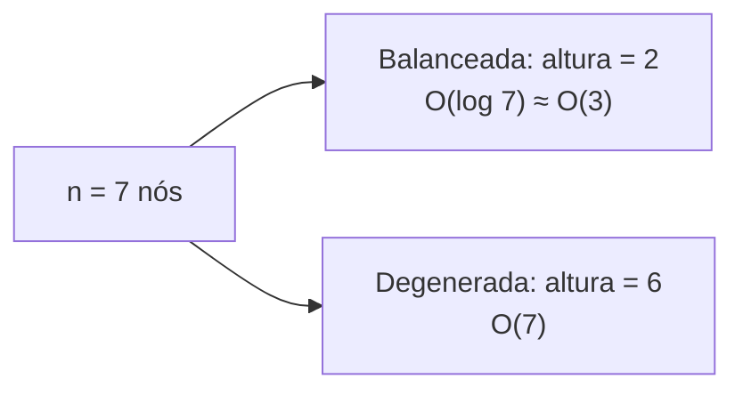
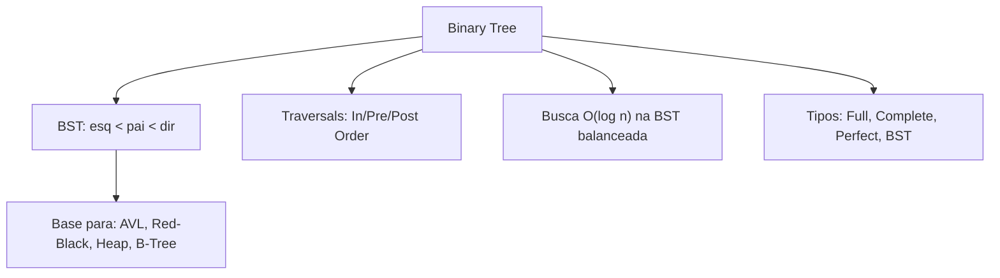

# Binary Trees (Árvores Binárias) — Hierarquia e Busca Eficiente

> 💡 **Dica inicial:** Pense em um torneio de tênis. Cada partida tem um vencedor, que avança para a próxima fase. No final, há apenas um campeão. Essa estrutura em forma de "brackets" é uma árvore binária!

---

## 1. O que é uma Árvore Binária?

Uma **Árvore Binária (Binary Tree)** é uma estrutura de dados hierárquica composta por **nós**, onde cada nó possui, no máximo, **dois filhos**: um filho à **esquerda** e um filho à **direita**.

```
          [10]          ← Raiz (Root)
         /    \
       [6]    [15]      ← Nós internos
      / \       \
    [4] [8]    [20]     ← Folhas (Leaves)
```

### Terminologia essencial:

| Termo          | Significado                                              |
|----------------|----------------------------------------------------------|
| **Raiz (Root)**| O nó principal, sem pai                                  |
| **Filho (Child)**| Nó diretamente abaixo de outro                         |
| **Pai (Parent)**| Nó diretamente acima de outro                           |
| **Folha (Leaf)**| Nó sem filhos                                          |
| **Altura**     | Número de arestas do caminho mais longo da raiz à folha  |
| **Profundidade**| Distância de um nó até a raiz                          |

---

## 2. Tipos de Árvores Binárias

### ✅ Full Binary Tree
Todo nó tem 0 ou 2 filhos (nunca apenas 1).

### ✅ Complete Binary Tree
Todos os níveis estão completamente preenchidos, exceto possivelmente o último (preenchido da esquerda para a direita).

### ✅ Perfect Binary Tree
Todos os nós internos têm 2 filhos e todas as folhas estão no mesmo nível.

### ⭐ Binary Search Tree (BST) — Árvore Binária de Busca
A mais importante! Segue a regra:
- **Nós à esquerda** têm valores **menores** que o nó pai.
- **Nós à direita** têm valores **maiores** que o nó pai.

```
          [10]
         /    \
       [6]    [15]
      / \     / \
    [4] [8] [12] [20]

  Esquerda < Pai < Direita ← sempre!
```

---

## 3. Complexidade em uma BST

| Operação    | Caso Médio   | Pior Caso (árvore degenerada) |
|-------------|--------------|-------------------------------|
| Busca       | **O(log n)** | O(n)                          |
| Inserção    | **O(log n)** | O(n)                          |
| Remoção     | **O(log n)** | O(n)                          |

> ⚠️ **Pior caso:** Uma árvore "degenerada" se parece com uma lista encadeada (todos os nós vão apenas para a direita ou esquerda). Nesse cenário, as operações se tornam O(n). Por isso existem **árvores balanceadas** como AVL e Red-Black Trees.



---

## 4. Formas de Percorrer uma Árvore (Traversals)

Existem três formas clássicas de visitar todos os nós de uma árvore binária:

### 🔢 In-Order (Esquerda → Raiz → Direita)
Em uma BST, produz os elementos em **ordem crescente**.

```
        [10]
       /    \
     [6]    [15]

In-Order: 6 → 10 → 15
```

### 🔢 Pre-Order (Raiz → Esquerda → Direita)
Útil para **clonar** ou **serializar** a árvore.

```
Pre-Order: 10 → 6 → 15
```

### 🔢 Post-Order (Esquerda → Direita → Raiz)
Útil para **deletar** a árvore ou avaliar expressões matemáticas.

```
Post-Order: 6 → 15 → 10
```

---

## 5. Exemplos de Código

### Estrutura e Inserção em BST

**Python**
```python
class Node:
    def __init__(self, valor):
        self.valor = valor
        self.esquerda = None
        self.direita = None

class BST:
    def __init__(self):
        self.raiz = None

    def inserir(self, valor):
        self.raiz = self._inserir(self.raiz, valor)

    def _inserir(self, no, valor):
        if no is None:
            return Node(valor)
        if valor < no.valor:
            no.esquerda = self._inserir(no.esquerda, valor)
        elif valor > no.valor:
            no.direita = self._inserir(no.direita, valor)
        return no

    def in_order(self, no=None, resultado=None):
        if resultado is None:
            resultado = []
            no = self.raiz
        if no:
            self.in_order(no.esquerda, resultado)
            resultado.append(no.valor)
            self.in_order(no.direita, resultado)
        return resultado

bst = BST()
for v in [10, 6, 15, 4, 8, 12, 20]:
    bst.inserir(v)

print(bst.in_order())  # [4, 6, 8, 10, 12, 15, 20] — ordenado!
```

**Java**
```java
class Node {
    int valor;
    Node esquerda, direita;
    Node(int v) { this.valor = v; }
}

class BST {
    Node raiz;

    Node inserir(Node no, int valor) {
        if (no == null) return new Node(valor);
        if (valor < no.valor) no.esquerda = inserir(no.esquerda, valor);
        else if (valor > no.valor) no.direita = inserir(no.direita, valor);
        return no;
    }

    void inOrder(Node no) {
        if (no == null) return;
        inOrder(no.esquerda);
        System.out.print(no.valor + " ");
        inOrder(no.direita);
    }
}
```

**TypeScript**
```typescript
class TreeNode {
    valor: number;
    esquerda: TreeNode | null = null;
    direita: TreeNode | null = null;
    constructor(valor: number) { this.valor = valor; }
}

class BST {
    raiz: TreeNode | null = null;

    inserir(valor: number): void {
        this.raiz = this._inserir(this.raiz, valor);
    }

    private _inserir(no: TreeNode | null, valor: number): TreeNode {
        if (!no) return new TreeNode(valor);
        if (valor < no.valor) no.esquerda = this._inserir(no.esquerda, valor);
        else if (valor > no.valor) no.direita = this._inserir(no.direita, valor);
        return no;
    }

    inOrder(no: TreeNode | null = this.raiz): number[] {
        if (!no) return [];
        return [...this.inOrder(no.esquerda), no.valor, ...this.inOrder(no.direita)];
    }
}
```

---

### Busca em BST — O(log n)

**Python**
```python
def buscar(self, valor):
    return self._buscar(self.raiz, valor)

def _buscar(self, no, valor):
    if no is None or no.valor == valor:
        return no
    if valor < no.valor:
        return self._buscar(no.esquerda, valor)  # vai para esquerda
    return self._buscar(no.direita, valor)        # vai para direita
```

---

## 6. Casos de Uso no Mundo Real



---

## 7. Altura e Balanceamento

A **altura** de uma árvore binária determina a eficiência das operações. Uma árvore com `n` nós:

- **Balanceada:** altura ≈ log₂(n) → operações O(log n) ✅
- **Degenerada:** altura = n → operações O(n) ❌



> 🔑 **Árvores auto-balanceadas** (AVL, Red-Black) garantem que a altura se mantenha próxima de log(n) automaticamente após inserções e remoções.

---

## 8. Resumo Visual



---

> 🚀 **Próximos passos:** As árvores são incríveis para dados hierárquicos, mas e se os dados tiverem **relações complexas, não hierárquicas**, como cidades conectadas por estradas? Para isso, precisamos dos **Grafos (Graphs)** — a estrutura mais geral e poderosa de todas!
