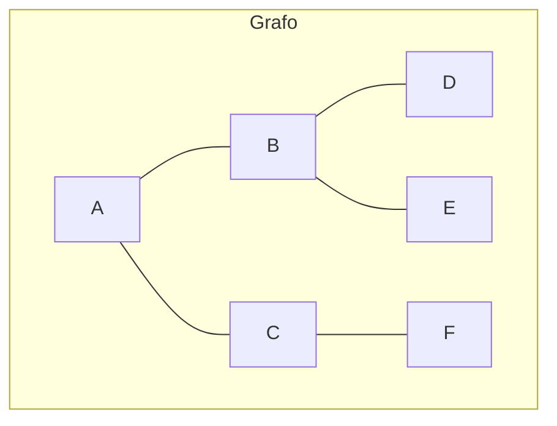
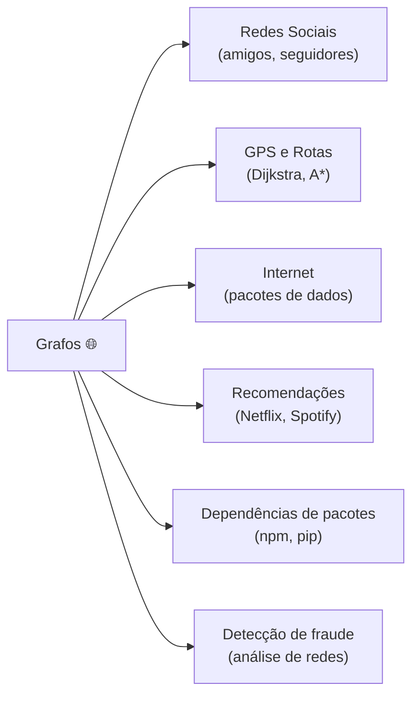
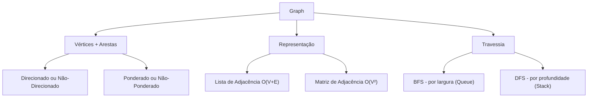

# Graphs (Grafos) — Modelando o Mundo Real

> 💡 **Dica inicial:** Pense no mapa do metrô de uma cidade. Cada estação é um ponto, e os trilhos são as conexões entre elas. Você pode ir de qualquer estação a outra seguindo os trilhos. Isso é um Grafo!

---

## 1. O que é um Grafo?

Um **Grafo (Graph)** é uma estrutura de dados composta por:
- **Vértices (Vertices / Nodes):** os "pontos" ou "nós" do grafo.
- **Arestas (Edges):** as conexões entre os vértices.

Enquanto árvores representam hierarquia e listas representam sequência, grafos representam **relações arbitrárias entre entidades** — qualquer coisa pode se conectar a qualquer outra coisa.

```
    A ─── B
    │     │ \
    │     │  E
    │     │ /
    C ─── D
```

> Aqui, A, B, C, D e E são vértices, e as linhas entre eles são arestas.

---

## 2. Tipos de Grafos

### 🔀 Grafo Não-Direcionado (Undirected)
As arestas não têm direção. Se A está conectado a B, então B também está conectado a A.
```
A ─── B ─── C
```

### ➡️ Grafo Direcionado (Directed / Dígrafo)
As arestas têm direção (setas). A conexão de A para B não implica conexão de B para A.
```
A ──► B ──► C
▲          │
└──────────┘
```

### ⚖️ Grafo Ponderado (Weighted)
Cada aresta tem um **peso** (custo, distância, tempo). Essencial para encontrar o caminho mais curto.
```
A ──5── B ──3── C
 \             /
  ─────10─────
```

### 🔄 Grafo Cíclico vs Acíclico
- **Cíclico:** existe um caminho que começa e termina no mesmo vértice.
- **Acíclico:** não há ciclos. Um DAG (Directed Acyclic Graph) é muito usado em dependências de tarefas.

---

## 3. Formas de Representar um Grafo

### 📋 Lista de Adjacência (Adjacency List)
Cada vértice mantém uma lista dos seus vizinhos. **Eficiente em memória** para grafos esparsos.

```
A → [B, C]
B → [A, D, E]
C → [A, D]
D → [B, C]
E → [B]
```

### 🔲 Matriz de Adjacência (Adjacency Matrix)
Uma grade N×N onde `matrix[i][j] = 1` se existe aresta entre i e j. **Acesso rápido** mas usa O(V²) de memória.

```
    A  B  C  D  E
A [ 0  1  1  0  0 ]
B [ 1  0  0  1  1 ]
C [ 1  0  0  1  0 ]
D [ 0  1  1  0  0 ]
E [ 0  1  0  0  0 ]
```

| Representação     | Espaço    | Checar aresta | Listar vizinhos |
|-------------------|-----------|---------------|-----------------|
| Lista de Adjacência | O(V + E)| O(grau)       | O(grau)         |
| Matriz de Adjacência | O(V²)  | O(1)          | O(V)            |

---

## 4. Algoritmos de Travessia

### 🌊 BFS — Busca em Largura (Breadth-First Search)
Visita todos os vizinhos do nó atual antes de ir mais fundo. Usa uma **Queue** internamente. Ideal para encontrar o **caminho mais curto** em grafos não ponderados.

```
Grafo:       BFS a partir de A:
A─B          Nível 0: A
│ │          Nível 1: B, C
C─D          Nível 2: D
             Ordem visitada: A → B → C → D
```

**Python**
```python
from collections import deque

def bfs(grafo, inicio):
    visitados = set()
    fila = deque([inicio])
    visitados.add(inicio)
    ordem = []

    while fila:
        vertice = fila.popleft()
        ordem.append(vertice)

        for vizinho in grafo[vertice]:
            if vizinho not in visitados:
                visitados.add(vizinho)
                fila.append(vizinho)

    return ordem

grafo = {
    'A': ['B', 'C'],
    'B': ['A', 'D'],
    'C': ['A', 'D'],
    'D': ['B', 'C']
}
print(bfs(grafo, 'A'))  # ['A', 'B', 'C', 'D']
```

---

### 🏔️ DFS — Busca em Profundidade (Depth-First Search)
Vai o mais fundo possível antes de voltar. Usa uma **Stack** (ou recursão). Ideal para detectar ciclos, ordenação topológica e explorar labirintos.

**Python**
```python
def dfs(grafo, inicio, visitados=None):
    if visitados is None:
        visitados = set()
    visitados.add(inicio)
    print(inicio, end=" ")

    for vizinho in grafo[inicio]:
        if vizinho not in visitados:
            dfs(grafo, vizinho, visitados)

grafo = {
    'A': ['B', 'C'],
    'B': ['A', 'D'],
    'C': ['A', 'D'],
    'D': ['B', 'C']
}
dfs(grafo, 'A')  # A B D C (ou variações dependendo da ordem dos vizinhos)
```

**TypeScript**
```typescript
function bfs(grafo: Record<string, string[]>, inicio: string): string[] {
    const visitados = new Set<string>();
    const fila: string[] = [inicio];
    const ordem: string[] = [];
    visitados.add(inicio);

    while (fila.length > 0) {
        const vertice = fila.shift()!;
        ordem.push(vertice);

        for (const vizinho of grafo[vertice]) {
            if (!visitados.has(vizinho)) {
                visitados.add(vizinho);
                fila.push(vizinho);
            }
        }
    }
    return ordem;
}
```

---

## 5. Complexidade dos Algoritmos Principais

| Algoritmo               | Complexidade de Tempo | Uso Principal                          |
|-------------------------|----------------------|----------------------------------------|
| BFS                     | O(V + E)             | Menor caminho (não ponderado)          |
| DFS                     | O(V + E)             | Ciclos, componentes, topológica        |
| Dijkstra                | O((V + E) log V)     | Menor caminho (ponderado, sem negativos)|
| Bellman-Ford            | O(V × E)             | Menor caminho (com pesos negativos)    |
| Prim / Kruskal          | O(E log V)           | Árvore Geradora Mínima                 |

---

## 6. Visualização BFS vs DFS



```
BFS (por níveis):    A → B → C → D → E → F
DFS (por profundidade): A → B → D → E → C → F
```

---

## 7. Casos de Uso no Mundo Real



---

## 8. Representação em Código — Lista de Adjacência

**Java**
```java
import java.util.*;

class Grafo {
    private Map<String, List<String>> adjacencia = new HashMap<>();

    void adicionarVertice(String v) {
        adjacencia.putIfAbsent(v, new ArrayList<>());
    }

    void adicionarAresta(String u, String v) {
        adjacencia.get(u).add(v);
        adjacencia.get(v).add(u); // não-direcionado
    }

    List<String> bfs(String inicio) {
        List<String> ordem = new ArrayList<>();
        Set<String> visitados = new HashSet<>();
        Queue<String> fila = new LinkedList<>();

        fila.offer(inicio);
        visitados.add(inicio);

        while (!fila.isEmpty()) {
            String vertice = fila.poll();
            ordem.add(vertice);
            for (String vizinho : adjacencia.get(vertice)) {
                if (!visitados.contains(vizinho)) {
                    visitados.add(vizinho);
                    fila.offer(vizinho);
                }
            }
        }
        return ordem;
    }
}
```

---

## 9. Resumo Visual



---

> 🚀 **Próximos passos:** Você já conhece as grandes estruturas. Agora vamos explorar estruturas mais especializadas: a **Trie** — uma árvore otimizada para trabalhar com **strings e palavras**, perfeita para buscas de texto e autocompletar!
