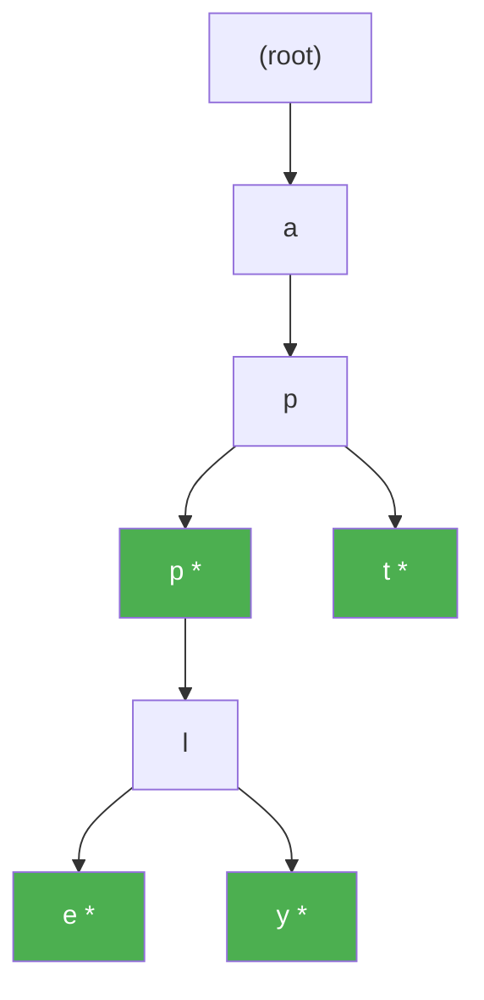
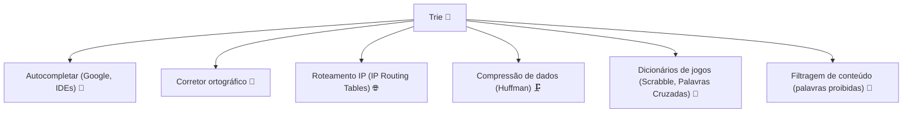
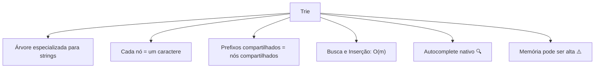

# Trie — A Árvore das Palavras

> 💡 **Dica inicial:** Sabe quando você começa a digitar no Google e ele sugere as palavras? Ou quando o celular autocompleta enquanto você escreve? Por baixo dos panos, estruturas como a Trie são responsáveis por isso. É uma das estruturas mais elegantes para trabalhar com texto!

---

## 1. O que é uma Trie?

Uma **Trie** (pronuncia-se *"try"*, derivado de *re**trie**val*) é uma estrutura de dados em forma de **árvore especializada para armazenar strings**. Cada nó representa um **caractere**, e os caminhos da raiz até as folhas formam palavras completas.

A grande sacada: **palavras com prefixos em comum compartilham os mesmos nós**!

```
Palavras: "car", "card", "care", "cat", "bat"

            (root)
           /      \
         [c]      [b]
          |        |
         [a]      [a]
        / | \      |
      [r] [t] [t]  [t]
      /\   *        *
    [d][e]
     *  *

* = marcador de fim de palavra
```

---

## 2. Estrutura de um Nó de Trie

Cada nó contém:
1. Um **mapa de filhos** (geralmente 26 para o alfabeto inglês ou um dicionário genérico).
2. Um **marcador booleano** indicando se aquele nó é o fim de uma palavra válida.

```python
class TrieNode:
    def __init__(self):
        self.filhos = {}       # {'a': TrieNode, 'b': TrieNode, ...}
        self.fim_de_palavra = False
```

---

## 3. Operações e Complexidade

| Operação           | Complexidade | Descrição                                          |
|--------------------|--------------|----------------------------------------------------|
| **Inserção**       | **O(m)**     | m = comprimento da palavra                         |
| **Busca**          | **O(m)**     | m = comprimento da palavra buscada                 |
| **Deleção**        | **O(m)**     | m = comprimento da palavra                         |
| **Autocomplete**   | **O(p + n)** | p = prefixo, n = número de palavras com o prefixo  |
| **Espaço**         | **O(ALPHABET_SIZE × m × n)** | n = número de palavras           |

> 🎯 **O ponto forte:** Busca e inserção são O(m), onde m é o tamanho da palavra — **independente do número de palavras na Trie!** Uma Trie com 1 milhão de palavras busca tão rápido quanto uma com 10 palavras, desde que a palavra buscada tenha o mesmo tamanho.

---

## 4. Visualizando a Inserção

Inserindo as palavras: `"app"`, `"apple"`, `"apply"`, `"apt"`



> Os nós verdes marcam o fim de uma palavra válida. Note que "app", "apple", "apply" e "apt" compartilham os nós iniciais!

---

## 5. Exemplos de Código

### Implementação Completa da Trie

**Python**
```python
class TrieNode:
    def __init__(self):
        self.filhos = {}
        self.fim_de_palavra = False

class Trie:
    def __init__(self):
        self.raiz = TrieNode()

    def inserir(self, palavra: str) -> None:
        no = self.raiz
        for char in palavra:
            if char not in no.filhos:
                no.filhos[char] = TrieNode()
            no = no.filhos[char]
        no.fim_de_palavra = True

    def buscar(self, palavra: str) -> bool:
        no = self.raiz
        for char in palavra:
            if char not in no.filhos:
                return False
            no = no.filhos[char]
        return no.fim_de_palavra

    def começa_com(self, prefixo: str) -> bool:
        no = self.raiz
        for char in prefixo:
            if char not in no.filhos:
                return False
            no = no.filhos[char]
        return True  # basta chegar ao fim do prefixo

    def autocomplete(self, prefixo: str) -> list:
        no = self.raiz
        for char in prefixo:
            if char not in no.filhos:
                return []
            no = no.filhos[char]
        # Agora coletamos todas as palavras a partir deste ponto
        resultado = []
        self._coletar(no, prefixo, resultado)
        return resultado

    def _coletar(self, no, prefixo_atual, resultado):
        if no.fim_de_palavra:
            resultado.append(prefixo_atual)
        for char, filho in no.filhos.items():
            self._coletar(filho, prefixo_atual + char, resultado)

# Uso
trie = Trie()
for palavra in ["app", "apple", "apply", "apt", "bat", "ball"]:
    trie.inserir(palavra)

print(trie.buscar("apple"))        # True
print(trie.buscar("ap"))           # False (não é palavra completa)
print(trie.começa_com("ap"))       # True
print(trie.autocomplete("ap"))     # ['app', 'apple', 'apply', 'apt']
print(trie.autocomplete("ba"))     # ['bat', 'ball']
```

**Java**
```java
import java.util.*;

class TrieNode {
    Map<Character, TrieNode> filhos = new HashMap<>();
    boolean fimDePalavra = false;
}

class Trie {
    TrieNode raiz = new TrieNode();

    void inserir(String palavra) {
        TrieNode no = raiz;
        for (char c : palavra.toCharArray()) {
            no.filhos.putIfAbsent(c, new TrieNode());
            no = no.filhos.get(c);
        }
        no.fimDePalavra = true;
    }

    boolean buscar(String palavra) {
        TrieNode no = raiz;
        for (char c : palavra.toCharArray()) {
            if (!no.filhos.containsKey(c)) return false;
            no = no.filhos.get(c);
        }
        return no.fimDePalavra;
    }

    boolean começaCom(String prefixo) {
        TrieNode no = raiz;
        for (char c : prefixo.toCharArray()) {
            if (!no.filhos.containsKey(c)) return false;
            no = no.filhos.get(c);
        }
        return true;
    }
}
```

**TypeScript**
```typescript
class TrieNode {
    filhos: Map<string, TrieNode> = new Map();
    fimDePalavra: boolean = false;
}

class Trie {
    private raiz = new TrieNode();

    inserir(palavra: string): void {
        let no = this.raiz;
        for (const char of palavra) {
            if (!no.filhos.has(char)) {
                no.filhos.set(char, new TrieNode());
            }
            no = no.filhos.get(char)!;
        }
        no.fimDePalavra = true;
    }

    buscar(palavra: string): boolean {
        let no = this.raiz;
        for (const char of palavra) {
            if (!no.filhos.has(char)) return false;
            no = no.filhos.get(char)!;
        }
        return no.fimDePalavra;
    }

    começaCom(prefixo: string): boolean {
        let no = this.raiz;
        for (const char of prefixo) {
            if (!no.filhos.has(char)) return false;
            no = no.filhos.get(char)!;
        }
        return true;
    }
}
```

---

## 6. Trie vs HashSet/HashMap para Busca de Palavras

| Critério                   | Trie                     | HashSet               |
|----------------------------|--------------------------|-----------------------|
| Busca de palavra           | O(m) ✅                  | O(m) ✅              |
| Busca por prefixo          | O(p + n) ✅              | O(n × m) ❌          |
| Autocomplete               | Natural e eficiente ✅   | Custoso ❌           |
| Memória                    | Pode ser alta ⚠️          | Geralmente menor ✅  |
| Ordenação lexicográfica    | Intrínseca ✅            | Requer sort ❌       |

> 🔑 **Use Trie quando** você precisa de operações com **prefixos**. Para simples busca de palavras sem prefixo, um HashSet pode ser suficiente.

---

## 7. Casos de Uso no Mundo Real



---

## 8. Resumo Visual



---

> 🚀 **Próximos passos:** Para fechar nossa jornada introdutória, vamos conhecer a **B-Tree** — uma das estruturas mais importantes em sistemas de produção, responsável por fazer os **bancos de dados** funcionarem de forma eficiente mesmo com bilhões de registros!
