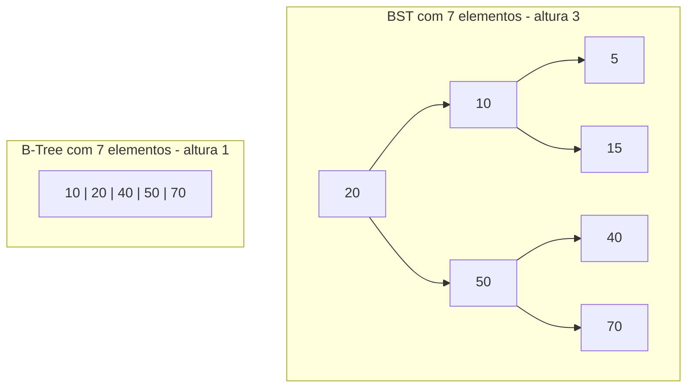
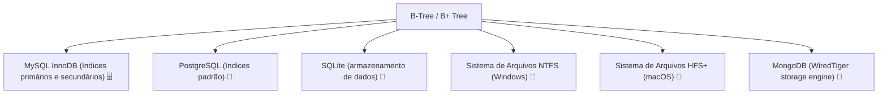
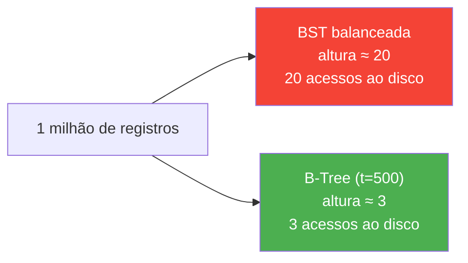
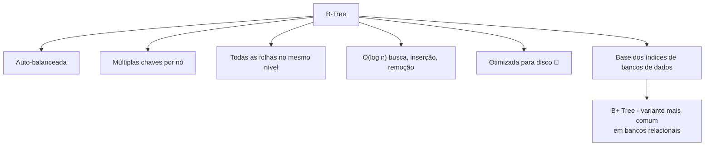

# B-Tree (Árvore B) — A Estrutura que Faz Bancos de Dados Voarem

> 💡 **Dica inicial:** Sempre que você faz uma busca em um banco de dados e ela retorna em milissegundos, mesmo com milhões de registros, provavelmente tem uma B-Tree trabalhando nos bastidores. É uma das estruturas mais importantes para sistemas de produção!

---

## 1. O que é uma B-Tree?

Uma **B-Tree (Árvore B)** é uma **árvore de busca auto-balanceada** generalizada, projetada para funcionar eficientemente em sistemas que trabalham com **armazenamento em disco** (bancos de dados, sistemas de arquivos).

A diferença principal para a BST tradicional: cada nó pode ter **muitos filhos** (não apenas 2), o que reduz drasticamente a altura da árvore e, portanto, o número de acessos ao disco.

> 💾 **Por que isso importa?** Acessar dados em disco é ~100.000 vezes mais lento que acessar na RAM. Uma árvore mais "baixa e larga" significa menos acessos ao disco.

---

## 2. Anatomia de uma B-Tree

### Propriedades fundamentais de uma B-Tree de ordem `t` (grau mínimo):
- Cada nó (exceto a raiz) tem **pelo menos `t-1` chaves** e **pelo menos `t` filhos**.
- Cada nó tem **no máximo `2t-1` chaves** e **no máximo `2t` filhos**.
- A raiz tem no mínimo 1 chave.
- **Todas as folhas estão no mesmo nível** (árvore perfeitamente balanceada).
- As chaves dentro de cada nó estão em **ordem crescente**.

```
B-Tree de ordem t=2 (cada nó tem 1 a 3 chaves, 2 a 4 filhos):

                    [ 30 | 70 ]
                   /     |     \
          [10|20]      [40|60]      [80|90]
         /  |  \      /  |  \      /  |  \
        ...        ...             ...
```

---

## 3. B-Tree vs BST — A Diferença Visual



> Com mais dados, a vantagem da B-Tree se torna ainda mais dramática: uma BST pode ter altura 20 enquanto uma B-Tree com os mesmos dados pode ter apenas altura 2-3.

---

## 4. Operações e Complexidade

| Operação    | Complexidade        | Detalhe                                      |
|-------------|---------------------|----------------------------------------------|
| **Busca**   | **O(log n)**        | Muito menos acessos a disco que BST          |
| **Inserção**| **O(log n)**        | Com possível split de nós                    |
| **Remoção** | **O(log n)**        | Com possível merge de nós                    |
| **Espaço**  | **O(n)**            | Linear no número de chaves                   |

> 🔑 A complexidade assintótica é similar à BST, mas a **constante** é dramaticamente menor em disco, pois a altura é muito menor.

---

## 5. Como Funciona a Busca?

A busca em uma B-Tree é similar à BST, mas em cada nó comparamos com múltiplas chaves:

```
Buscando 45 em:        [ 20 | 50 | 80 ]
                       /    |    |    \
               [10|15] [30|40|45] [60|70] [90|95]

Passo 1: Na raiz, 45 < 50 e 45 > 20 → vai para o segundo filho
Passo 2: No nó [30|40|45], encontrou 45! ✅
```

**Python** — Busca simplificada
```python
class BTreeNode:
    def __init__(self, folha=True):
        self.chaves = []           # lista de chaves do nó
        self.filhos = []           # lista de nós filhos
        self.folha = folha

class BTree:
    def __init__(self, t):
        self.raiz = BTreeNode()
        self.t = t  # grau mínimo

    def buscar(self, k, no=None):
        if no is None:
            no = self.raiz

        # Encontra a primeira chave >= k
        i = 0
        while i < len(no.chaves) and k > no.chaves[i]:
            i += 1

        # Encontrou a chave
        if i < len(no.chaves) and k == no.chaves[i]:
            return (no, i)

        # É uma folha e não encontrou
        if no.folha:
            return None

        # Vai para o filho apropriado
        return self.buscar(k, no.filhos[i])
```

---

## 6. Divisão de Nós (Split) na Inserção

Quando um nó atinge o número máximo de chaves, ele é **dividido (split)** em dois, e a chave do meio sobe para o nó pai:

```
Inserindo 35 em um nó cheio [10 | 20 | 30]:

Antes:                   Depois do split:
    [10|20|30]              [20]
                           /    \
                        [10]   [30|35]
```

**Python** — Lógica de split
```python
def _split_filho(self, pai, i):
    t = self.t
    novo = BTreeNode(folha=pai.filhos[i].folha)
    cheio = pai.filhos[i]

    # Move a chave do meio para o pai
    pai.chaves.insert(i, cheio.chaves[t - 1])
    pai.filhos.insert(i + 1, novo)

    # Divide as chaves
    novo.chaves = cheio.chaves[t:]
    cheio.chaves = cheio.chaves[:t - 1]

    # Divide os filhos (se não for folha)
    if not cheio.folha:
        novo.filhos = cheio.filhos[t:]
        cheio.filhos = cheio.filhos[:t]
```

---

## 7. B+ Tree — A Variante Mais Usada em Bancos de Dados

A **B+ Tree** é uma variação da B-Tree que é mais comum em bancos de dados reais:

| Característica         | B-Tree                     | B+ Tree                          |
|------------------------|----------------------------|----------------------------------|
| Dados armazenados      | Em todos os nós            | Apenas nas folhas                |
| Folhas                 | Não conectadas             | Conectadas em lista encadeada    |
| Busca por intervalo    | Menos eficiente            | Muito eficiente (percorre folhas)|
| Uso comum              | Sistemas de arquivo        | Bancos de dados (MySQL, PostgreSQL)|

```
B+ Tree:
         [30 | 70]             ← nós internos só guardam chaves (roteamento)
        /    |     \
    [10|20] [40|60] [80|90]    ← folhas guardam os dados reais
       ↓       ↓       ↓
    dados    dados    dados
      └────────────────┘       ← folhas ligadas em lista encadeada!
```

> 📊 **Por que a B+ Tree é melhor para bancos?** A query `SELECT * WHERE id BETWEEN 30 AND 80` percorre apenas as folhas em sequência — sem voltar aos nós internos!

---

## 8. Onde B-Trees São Usadas no Mundo Real



---

## 9. Por que não usar BST em Bancos de Dados?



Com um SSD que leva ~0.1ms por acesso:
- BST: 20 acessos × 0.1ms = **2ms**
- B-Tree: 3 acessos × 0.1ms = **0.3ms**

Com discos mecânicos (10ms por acesso):
- BST: 20 × 10ms = **200ms** 😱
- B-Tree: 3 × 10ms = **30ms** ✅

---

## 10. Resumo Visual



---

> 🎓 **Parabéns por chegar até aqui!** Você concluiu o módulo introdutório de Estruturas de Dados. Neste módulo você aprendeu: **Arrays**, **Linked Lists**, **Queues**, **Stacks**, **Binary Trees**, **Graphs**, **Tries** e **B-Trees**. Com essa base sólida, você está preparado para aprofundar cada estrutura, estudar algoritmos mais complexos e entender como os sistemas que usamos no dia a dia funcionam por baixo dos panos. O próximo passo é aprofundar cada estrutura com seus algoritmos associados e explorar variações mais avançadas. Bons estudos! 🚀
